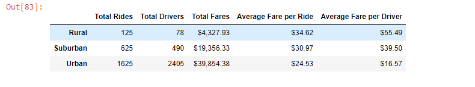
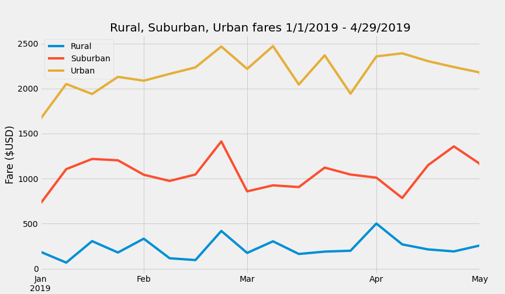

# PyBer Analysis
Columbia Data Science Module 5

## Overview of Analysis
V. Isualize has assigned Omar and me to create a summary dataframe of ride share data broken down by rural, suburban, and urban rides. Additionally, we created a line graph to displa total weekly fares for rural, suburban, and urban rides for the period between January 1st, 2019 and April 29th, 2019. 

## Results
 

### Total Rides
As might be expected based on population density, urban rides were most common, representing 1,625 of all rides. Suburban rides were next most common with 625 rides, and rural reides were the least common, with 125 rides. 

### Total Drivers
Correspondingly, the total number of drivers follows the same pattern as the number of rides. Urban areas have the most drivers - 2,405, suburban areas have less - 490, and rural areas have the least with 78 drivers. 

### Total Fares
Urban areas contribute the most to fare income - $39,854.38. Suburban regions are next with $19,356.33 in total fares. Finally, rural areas bring in the least total fare revenue - $4,327.93. 

### Average Fare per Ride
While rural areas might represent the fewest number of rides and the smallest amount of fare revenue, they actually generate the largest fare per ride - $34.62. In contrast, suburban rides generate $30.97 per ride and urban areas bring in $24.53 per ride on average. 

### Average Fare per Driver
Rural areas also have the smallest number of drivers while simultaneously having the highest average fare per driver - $55.49. Suburban drivers average $39.50 per ride and urban drivers average $16.57 per ride.

## Summary and Recommendations

 

As can be seen in the chart above, there appears to be a spike in ridership across rural, suburban, and urban rides in late February. As we look at adapting to seasonal shifts in demand, it may make sense to capitalize on this existing increase in ridership. For example, we may consider pushing discount codes to users' phones at the same time in late February this year. 

I also recommend looking into increasing ridership in rural areas. Currently, rural riders represent a small fraction of our ridership. While this may be due to population density, it's also possible there is a demand for rides in rural areas that we are not meeting due to insufficient drivers. On a per ride basis and a per driver basis, rural rides are the most profitable. (It's possible the relatively high prices of fares may be to to rural rides being longer on average due to lower population density.) Based on the potential untapped market in rural areas and its high likelihood of profit, it is worth investigating increased advertising to rural areas and recruit additional drivers in rural areas. 

Finally, I recommend providing incentives to urban drivers to pick up rural drivers. This would help solve the aforementioned problem of a lack of drivers in rural areas. It would also help increase the average fare per driver in urban areas, which is currently less than a third of average fare per driver in rural areas. There are likely two contributing factors to lower average fares in urban areas: first, the rides are most likely shorter on average than rural rides due to higher population density. Secondly, the price is low because supply is high in cities. There are 1.5 drivers per rides in cities, and only 0.6 drivers per ride in the countryside. By sending push notifications to drivers that they can get bonus fares by picking up rural passengers, we solve two problems simultaneously: tapping into the lucrative rural market while reducing the oversupply of urban drivers. 
